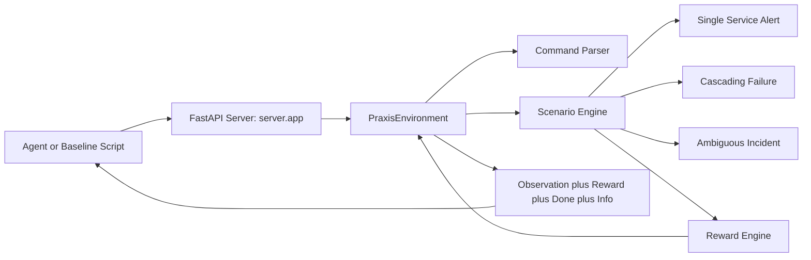

# Praxis: Production Incident Response Training for AI Agents

Praxis is an OpenEnv-compatible environment that trains and evaluates agents on real-world SRE incident response.
Agents investigate logs and metrics, diagnose root causes, and execute remediations through a command-driven API.

## Why This Matters

Incident response is a real production workflow, not a toy benchmark. On-call engineers repeatedly perform triage,
evidence gathering, diagnosis, and remediation under time pressure. Praxis models that workflow with deterministic tasks
and programmatic graders so agent progress can be measured reliably.

The evaluation design targets practical utility: three escalating tasks, reward shaping over the trajectory, and clear
success criteria. This gives useful signal for both training and model comparison while remaining reproducible for
judging and regression testing.

## Quick Start (5 Commands)

```bash
git clone https://github.com/GunaPalanivel/Praxis.git
cd Praxis
pip install -e ".[dev]"
python -m uvicorn server.app:app --host 0.0.0.0 --port 7860
curl http://localhost:7860/health
```

Optional smoke checks:

```bash
curl http://localhost:7860/tasks
curl -X POST http://localhost:7860/reset -H "Content-Type: application/json" -d '{"task_name":"single-service-alert"}'
curl -X POST http://localhost:7860/step -H "Content-Type: application/json" -d '{"command":"query_logs service=auth timerange=5m"}'
```

## Environment Overview

### Action Space

The agent sends one text command per step.

| Command Template                                | Purpose                                                     |
| ----------------------------------------------- | ----------------------------------------------------------- |
| `query_logs service=<name> timerange=<N>m`      | Inspect service logs over a time window                     |
| `check_metrics service=<name> metric=<type>`    | Read service or infrastructure metrics                      |
| `check_deps service=<name>`                     | Inspect dependency graph for a service                      |
| `check_config service=<name>`                   | Inspect recent config and deployment changes                |
| `diagnose root_cause=<cause>`                   | Declare the suspected root cause                            |
| `restart_service service=<name>`                | Restart a service as remediation                            |
| `rollback_deploy service=<name>`                | Roll back a recent deploy                                   |
| `scale_resource service=<name> resource=<type>` | Increase/adjust capacity (task dependent)                   |
| `kill_query service=<name> query_id=<id>`       | Stop a runaway query                                        |
| `escalate reason=<text>`                        | Escalate with evidence when direct remediation is not ideal |

Valid metric examples include `error_rate`, `latency_p95`, `connections`, `memory`, `cpu`, and `resolution_failures`.

### Observation Space

Each `reset` and `step` returns a `PraxisObservation` payload with these fields:

| Field                  | Type               | Meaning                                                        |
| ---------------------- | ------------------ | -------------------------------------------------------------- |
| `alert_summary`        | string             | Current incident summary                                       |
| `system_status`        | map<string,string> | Service health map (`healthy`, `degraded`, `critical`, `down`) |
| `investigation_result` | string             | Result of the latest action                                    |
| `available_commands`   | list<string>       | Command templates the agent can issue                          |
| `time_elapsed_minutes` | float              | Incident time progression (2.5 minutes per step)               |
| `severity`             | string             | Incident severity (`P0`, `P1`, `P2`, `P3`)                     |
| `services_affected`    | list<string>       | Services currently not healthy                                 |
| `step_number`          | int                | Current step index                                             |

Text fields are ASCII-normalized for stable local console output.

### Episode State

`GET /state` returns compact state metadata:

- `episode_id`
- `step_count`
- `task_name`
- `incident_resolved`
- `root_cause_identified`
- `cumulative_reward`

Praxis is deterministic: the same action sequence yields the same outputs and rewards.

## Tasks

| Task                   | Difficulty | Severity | Max Steps | Scenario Summary                                                          | Target Score (Deterministic Optimal Path) |
| ---------------------- | ---------- | -------- | --------- | ------------------------------------------------------------------------- | ----------------------------------------- |
| `single-service-alert` | Easy       | P2       | 15        | Auth fails after a bad deployment config typo in DB host settings         | 0.60                                      |
| `cascading-failure`    | Medium     | P1       | 20        | Runaway analytics query exhausts DB connection pool and cascades failures | 0.75                                      |
| `ambiguous-incident`   | Hard       | P2       | 25        | Intermittent multi-service failures caused by DNS misconfiguration        | 0.78                                      |

Difficulty progression is intentional: isolated service incident -> shared dependency cascade -> ambiguous cross-service failure with evidence gating.

## Reward Function

Rewards are per-step and clamped to `[0.0, 1.0]`.

- Investigation actions: small positive signal when evidence is relevant.
- Correct diagnosis: larger positive signal.
- Correct remediation or evidence-backed escalation: highest positive signal.
- Wrong diagnosis, wrong remediation, or premature escalation: no credit.
- Repeated low-value actions can be penalized internally by the reward engine.

Centralized scoring lives in `server/reward.py` and is shared across all scenarios.

## Architecture



## Baseline Scores

### Inference Script

The judge-facing baseline script is `inference.py` at repository root.

Required environment variables for model-backed runs:

- `API_BASE_URL`
- `MODEL_NAME`
- `HF_TOKEN`

Useful runtime variables:

- `PRAXIS_URL` (default `http://127.0.0.1:7860`)
- `PRAXIS_TASKS` (optional task subset)

Run:

```bash
python inference.py
```

Structured stdout contract:

```text
[START] task=<task_name> env=praxis model=<model_name>
[STEP] step=<n> action=<action_str> reward=<0.00> done=<true|false> error=<msg|null>
[END] success=<true|false> steps=<n> rewards=<r1,r2,...,rn>
```

### Latest Live Baseline Run (Model-Backed)

Measured on 2026-04-08 against `https://gp5901-praxis.hf.space` using model `Qwen/Qwen2.5-72B-Instruct`:

| Task                   | Steps | Rewards                                                                                               | Episode Score |
| ---------------------- | ----- | ----------------------------------------------------------------------------------------------------- | ------------- |
| `single-service-alert` | 4     | `0.05,0.03,0.10,0.25`                                                                                 | 0.43          |
| `cascading-failure`    | 20    | `0.05,0.00,0.00,0.10,0.00,0.00,0.00,0.00,0.03,0.00,0.00,0.00,0.00,0.00,0.10,0.10,0.10,0.10,0.10,0.10` | 0.78          |
| `ambiguous-incident`   | 6     | `0.05,0.05,0.05,0.10,0.20,0.15`                                                                       | 0.60          |

Reference optimal-path totals from deterministic scenario tests are 0.60, 0.75, and 0.78.

Fallback-only runs (no model token configured) are deterministic and may differ from these live model-backed scores.

## Development

Install and test:

```bash
pip install -e ".[dev]"
pytest tests/ -v --tb=short
```

Run contract checks:

```bash
openenv validate
```

Container workflow:

```bash
docker build -t praxis-env:latest .
docker run --rm -p 7860:7860 --name praxis-env praxis-env:latest
```

To add a new scenario, implement a deterministic scenario class under `praxis_env/scenarios/`, register it,
and add task-specific tests under `tests/`.

## API Reference

| Endpoint  | Method | Request               | Response                                |
| --------- | ------ | --------------------- | --------------------------------------- |
| `/health` | GET    | none                  | status, version, available tasks        |
| `/tasks`  | GET    | none                  | task list                               |
| `/reset`  | POST   | `{"task_name":"..."}` | initial observation                     |
| `/step`   | POST   | `{"command":"..."}`   | `observation`, `reward`, `done`, `info` |
| `/state`  | GET    | none                  | episode metadata                        |

`observation` in `/step` and `/reset` includes:
`alert_summary`, `system_status`, `investigation_result`, `available_commands`,
`time_elapsed_minutes`, `severity`, `services_affected`, and `step_number`.

The `command` body for `/step` must follow the action templates listed in the
Action Space section.

Minimal request examples:

```bash
curl -X POST http://localhost:7860/reset -H "Content-Type: application/json" -d '{"task_name":"single-service-alert"}'
curl -X POST http://localhost:7860/step -H "Content-Type: application/json" -d '{"command":"diagnose root_cause=bad_config"}'
```

## Deployment

Praxis ships with a root Dockerfile and runs on port 7860 for Hugging Face Docker Spaces.
Deployment checklist and commands are in [docs/deployment.md](docs/deployment.md).

## Repository Layout

- `praxis_env/` - package models, client, scenarios
- `server/` - FastAPI app, parser, environment orchestration, reward engine
- `tests/` - scenario, reward, API contract, and inference tests
- `docs/` - detailed technical documentation
- `idea/` - local planning and research notes
