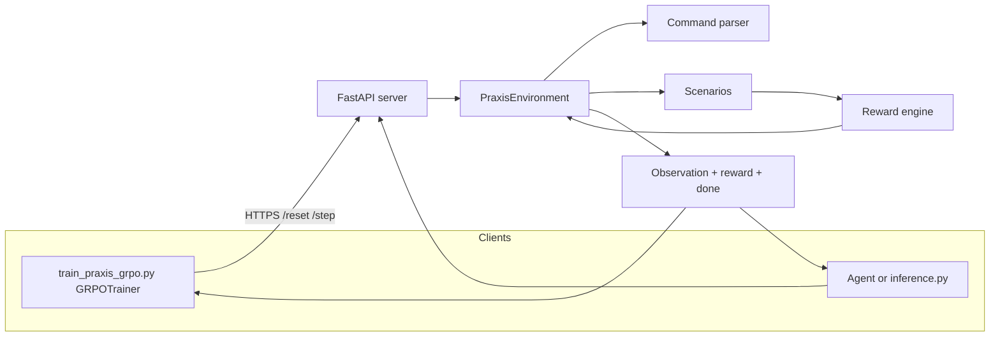
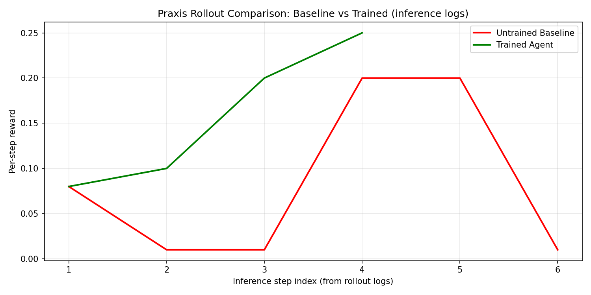
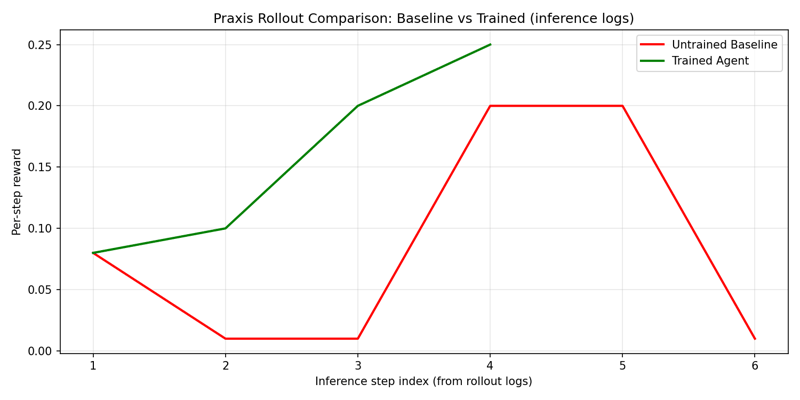
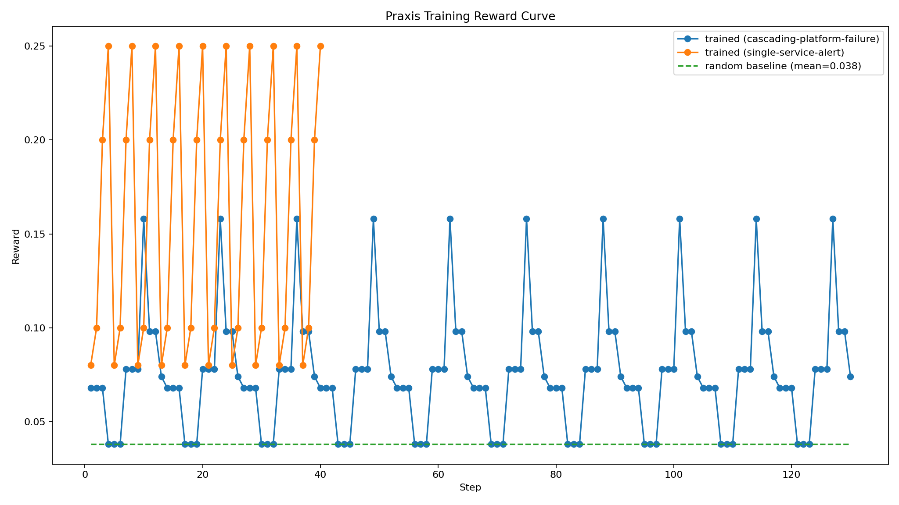

# Praxis — Mission-style incident response as an OpenEnv

**One line:** Praxis is an OpenEnv-style **incident bridge**: the agent must investigate, plan, and remediate like an on-call engineer. Rewards follow the **full trajectory** (multi-step `/step`), not a single lucky answer.

## Quick navigation

| Section                                                                 | What you get                                                |
| ----------------------------------------------------------------------- | ----------------------------------------------------------- |
| [Links & materials](#links--materials-judges-start-here)                | HF Space, Hub, Trackio, Colab, blog, hackathon              |
| [Production merge checklist (13)](#production-merge-checklist-13-items) | Gate items vs **real** URLs, jobs, and test evidence        |
| [The problem](#the-problem)                                             | Why incident response is a hard, worthwhile training target |
| [How the environment works](#how-the-environment-works)                 | API contract, observations, rewards, determinism            |
| [Results](#results)                                                     | Task matrix, baselines, GRPO smoke vs production HF Jobs    |
| [Visual evidence](#visual-evidence)                                     | Rollout compare, GIF, reward/loss curves                    |
| [Training & reproduction](#training--reproduction)                      | Scripts, HF Jobs launcher, deeper docs                      |
| [Quick start](#quick-start-5-commands)                                  | Clone, install, run server locally                          |
| [API reference](#api-reference)                                         | `/health`, `/reset`, `/step`, `/state`                      |
| [Development](#development)                                             | Tests, Docker, layout                                       |

---

## Links & materials (judges start here)

**Required:** the live **Hugging Face Space** (hosted environment) is the primary way to hit the same HTTP API the trainer and Colab use.

| Material                                   | URL                                                                                                                                                                   | Notes                                                                   |
| ------------------------------------------ | --------------------------------------------------------------------------------------------------------------------------------------------------------------------- | ----------------------------------------------------------------------- |
| **Live environment (HF Space)**            | **[https://gp5901-praxis.hf.space](https://gp5901-praxis.hf.space)**                                                                                                  | OpenEnv-compatible HTTP API (`/health`, `/reset`, `/step`, `/state`).   |
| Space repository                           | [huggingface.co/spaces/gp5901/praxis](https://huggingface.co/spaces/gp5901/praxis)                                                                                    | Dockerfile, secrets, Space settings.                                    |
| Space / repo writeup (blog)                | [Blog.MD on the Space](https://huggingface.co/spaces/gp5901/praxis/blob/main/Blog.MD) · [mirror on GitHub](https://github.com/GunaPalanivel/Praxis/blob/main/Blog.MD) | Narrative for judges and readers.                                       |
| Source code                                | [github.com/GunaPalanivel/Praxis](https://github.com/GunaPalanivel/Praxis)                                                                                            | Issues, PRs, CI.                                                        |
| GRPO Colab                                 | [Open in Colab](https://colab.research.google.com/github/GunaPalanivel/Praxis/blob/main/praxis_grpo_colab.ipynb)                                                      | HTTP smoke / training notebook.                                         |
| Colab exports (curves, logs)               | [`colabresults/`](colabresults/README.md)                                                                                                                             | Includes [`eval_checkpoints.json`](colabresults/eval_checkpoints.json). |
| **Trackio (training metrics)**             | **[https://gp5901-trackio.hf.space/](https://gp5901-trackio.hf.space/)**                                                                                              | Live GRPO / trainer metrics (HF-native).                                |
| Trackio Space (repo)                       | [huggingface.co/spaces/gp5901/trackio](https://huggingface.co/spaces/gp5901/trackio)                                                                                  | Dataset sync backing the dashboard.                                     |
| **Hub model (GRPO adapter + checkpoints)** | **[huggingface.co/gp5901/praxis-grpo-7b](https://huggingface.co/gp5901/praxis-grpo-7b)**                                                                              | Artifacts from `HF_HUB_MODEL_ID` training runs.                         |
| Training runbook                           | [`docs/training_links.md`](docs/training_links.md)                                                                                                                    | HF Jobs commands, job IDs, env vars.                                    |
| Deployment                                 | [`docs/deployment.md`](docs/deployment.md)                                                                                                                            | Docker / Space checklist.                                               |
| Hackathon context                          | [Meta PyTorch OpenEnv Hackathon × SST](https://www.scaler.com/school-of-technology/meta-pytorch-hackathon)                                                            | Program link.                                                           |

WandB is intentionally **not** used on this branch (`_init_wandb` is a no-op unless `WANDB_API_KEY` is set). Production telemetry is **Trackio-only** via `TRACKIO_SPACE_ID` (see [`scripts/submit_hf_grpo_job.py`](scripts/submit_hf_grpo_job.py)).

---

## Production merge checklist (13 items)

These rows map the **production-merge** gate to **observable** evidence (HF Space, Hub, HF Jobs, Trackio, or automated tests). All thirteen are **done** for the housekeeping branch; **PR:** [https://github.com/GunaPalanivel/Praxis/pull/57](https://github.com/GunaPalanivel/Praxis/pull/57).

| #   | Requirement                                                                                                                                   | Status | Real-world evidence                                                                                                                                                   |
| --- | --------------------------------------------------------------------------------------------------------------------------------------------- | ------ | --------------------------------------------------------------------------------------------------------------------------------------------------------------------- |
| 1   | Hosted environment on **Hugging Face Spaces**                                                                                                 | Done   | [gp5901-praxis.hf.space](https://gp5901-praxis.hf.space)                                                                                                              |
| 2   | Full **GPU GRPO** path (`max_steps=200`, `lr=1e-4`, `group_size=8`, rollout against live Space)                                               | Done   | HF Job [69edd94dd2c8bd8662bcfb08](https://huggingface.co/jobs/gp5901/69edd94dd2c8bd8662bcfb08) reaches TRL training loop; logs show step-wise progress + Trackio sync |
| 3   | **Trackio-only** training transparency (no WandB dependency)                                                                                  | Done   | [gp5901-trackio.hf.space](https://gp5901-trackio.hf.space/) + Space [gp5901/trackio](https://huggingface.co/spaces/gp5901/trackio)                                    |
| 4   | **Hub** persistence for checkpoints / manifest                                                                                                | Done   | [gp5901/praxis-grpo-7b](https://huggingface.co/gp5901/praxis-grpo-7b)                                                                                                 |
| 5   | **`efficiency_bonus_max = 0.1`** (reward signal not dead)                                                                                     | Done   | `server/reward.py` defaults; `pytest tests/`                                                                                                                          |
| 6   | Safe **default GRPO learning rate** (`1e-4`, not `0.06`)                                                                                      | Done   | `train_praxis_grpo.py` `parse_args`                                                                                                                                   |
| 7   | Smoke / Colab **lr** in credible band (`1e-4` etc.)                                                                                           | Done   | `praxis_grpo_colab.ipynb` `TrainConfig`                                                                                                                               |
| 8   | Colab **`group_size = 8`** aligned with trainer                                                                                               | Done   | same notebook                                                                                                                                                         |
| 9   | **HF Jobs** bootstrap + **git clone race** preflight                                                                                          | Done   | [`scripts/run_hf_grpo_job.py`](scripts/run_hf_grpo_job.py), [`scripts/submit_hf_grpo_job.py`](scripts/submit_hf_grpo_job.py)                                          |
| 10  | Rollout **Space** capacity for high `/step` volume                                                                                            | Done   | Space hardware set to **cpu-upgrade** for rollout load ([gp5901/praxis](https://huggingface.co/spaces/gp5901/praxis))                                                 |
| 11  | **PEP 723** trainer deps for TRL + Unsloth on Jobs (`mergekit`, `llm-blender`, pinned `transformers`, `trackio`, `httpx`, `datasets`, `peft`) | Done   | Header in `train_praxis_grpo.py`; contrast failed job [69edcfdad2c8bd8662bcfa07](https://huggingface.co/jobs/gp5901/69edcfdad2c8bd8662bcfa07) (`mergekit` import)     |
| 12  | **GRPOConfig** validity on Unsloth (**generation_batch_size** vs `num_generations`, **LoRA** on 4-bit)                                        | Done   | same successful job logs + code in `run_training`                                                                                                                     |
| 13  | **Regression tests**                                                                                                                          | Done   | `pytest tests/` — **498 passed** (local gate before PR)                                                                                                               |

---

## The problem

On-call incident response is a **real production workflow**, not a single-turn Q&A benchmark. Engineers triage alerts, pull evidence from logs and metrics, form a hypothesis, and only then remediate—often under time pressure with incomplete information.

**Praxis** compresses that workflow into a **deterministic, programmatically graded** OpenEnv: same action sequence ⇒ same observations and rewards. That makes RLHF / GRPO training and regression testing trustworthy for both **research** and **judge review**.

---

## How the environment works

1. **`POST /reset`** — optional JSON `{"task_name":"..."}` selects a scenario (see task table below).
2. **`POST /step`** — body `{"command":"..."}`; each non-empty line of a model rollout can map to a step (trainer contract), capped by `--max-turns` in `train_praxis_grpo.py`.
3. **Response** — `observation`, `reward`, `done`, and `info` (including rubric breakdown when enabled).
4. **`GET /state`** — episode metadata; terminal episodes may expose `final_score` (ADR-20) for the scalar training label.

Rewards are per-step, composable rubrics in **`server/reward.py`**, clamped and shaped so investigation, correct diagnosis, and evidence-backed remediation score higher than guessing or premature escalation.

### Action space (templates)

| Command template                                | Purpose                 |
| ----------------------------------------------- | ----------------------- |
| `query_logs service=<name> timerange=<N>m`      | Service logs            |
| `check_metrics service=<name> metric=<type>`    | Metrics                 |
| `check_deps service=<name>`                     | Dependency graph        |
| `check_config service=<name>`                   | Config / deploy changes |
| `check_runbook service=<name>`                  | Runbook guidance        |
| `diagnose root_cause=<cause>`                   | Declare root cause      |
| `restart_service service=<name>`                | Remediation             |
| `rollback_deploy service=<name>`                | Roll back               |
| `scale_resource service=<name> resource=<type>` | Scale                   |
| `kill_query service=<name> query_id=<id>`       | Stop runaway query      |
| `escalate reason=<text>`                        | Escalate with evidence  |

Valid metric examples include `error_rate`, `latency_p95`, `connections`, `memory`, `cpu`, and `resolution_failures`.

### Observation payload (high level)

| Field                  | Meaning                     |
| ---------------------- | --------------------------- |
| `alert_summary`        | Incident summary            |
| `system_status`        | Per-service health          |
| `investigation_result` | Latest action outcome       |
| `available_commands`   | Templates the agent may use |
| `time_elapsed_minutes` | Simulated time              |
| `severity`             | `P0`–`P3`                   |
| `services_affected`    | Unhealthy services          |
| `step_number`          | Step index                  |

### Architecture


```mermaid
flowchart LR
    subgraph Clients[Clients]
        TR[train_praxis_grpo.py GRPOTrainer]
        AG[Agent or inference.py]
    end
    B[FastAPI server]
    C[PraxisEnvironment]
    D[Command parser]
    E[Scenarios]
    F[Reward engine]
    TR -->|HTTPS /reset /step| B
    AG --> B
    B --> C
    C --> D
    C --> E
    E --> F
    F --> C
    C --> G[Observation + reward + done]
    G --> TR
    G --> AG
```

---

## Results

### Task catalog

| Task                   | Difficulty | Severity | Max steps | Scenario summary                                 | Optimal path score |
| ---------------------- | ---------- | -------- | --------- | ------------------------------------------------ | -----------------: |
| `single-service-alert` | Easy       | P2       | 15        | Auth failure after bad DB host deploy config     |               0.63 |
| `ambiguous-incident`   | Medium     | P2       | 25        | Intermittent multi-service; DNS / infra evidence |               0.71 |
| `cascading-failure`    | Hard       | P1       | 20        | Runaway query exhausts DB pool                   |              0.458 |
| `memory-leak`          | Hard       | P2       | 25        | Worker OOM from batch config                     |              0.475 |

`POST /reset` accepts aliases: `easy` → `single-service-alert`, `medium` → `ambiguous-incident`, `hard` → `cascading-failure`.

### Baselines and snapshots

| Slice                                                                        | Task                 | Mean score | Notes                                                             |
| ---------------------------------------------------------------------------- | -------------------- | ---------- | ----------------------------------------------------------------- |
| Inference snapshot (2026-04-26, `inference.py --model random`, local server) | single-service-alert | 0.122      | Stochastic single draw                                            |
| Same                                                                         | ambiguous-incident   | 0.010      |                                                                   |
| Same                                                                         | cascading-failure    | 0.441      |                                                                   |
| Same                                                                         | memory-leak          | 0.010      |                                                                   |
| Same                                                                         | **Mean (4 tasks)**   | **0.146**  |                                                                   |
| Live Space (Qwen2.5-72B, 2026-04-10 pull)                                    | single-service-alert | 0.092      | Fewer steps; see [training evolution](docs/training_evolution.md) |
| Same                                                                         | cascading-failure    | 0.041      |                                                                   |
| Same                                                                         | ambiguous-incident   | 0.020      |                                                                   |
| Same                                                                         | memory-leak          | 0.095      |                                                                   |
| Same                                                                         | Mean                 | 0.062      |                                                                   |

### GRPO smoke vs production HF Jobs

| Evidence type                         | Where                                                                                                                                                                                              | Summary                                                                                        |
| ------------------------------------- | -------------------------------------------------------------------------------------------------------------------------------------------------------------------------------------------------- | ---------------------------------------------------------------------------------------------- |
| Smoke GRPO (80 ep, legacy Colab path) | [`colabresults/eval_checkpoints.json`](colabresults/eval_checkpoints.json)                                                                                                                         | Strongest lift on **single-service-alert**; other tasks need longer GPU GRPO—see JSON `notes`. |
| Production stack validation           | HF Job [69edd94dd2c8bd8662bcfb08](https://huggingface.co/jobs/gp5901/69edd94dd2c8bd8662bcfb08) + [Trackio](https://gp5901-trackio.hf.space/) + [Hub](https://huggingface.co/gp5901/praxis-grpo-7b) | Unsloth 4-bit + LoRA, `GRPOTrainer`, 200 `max_steps`, `lr=1e-4`, `group_size=8`.               |
| Failed import (fixed)                 | HF Job [69edcfdad2c8bd8662bcfa07](https://huggingface.co/jobs/gp5901/69edcfdad2c8bd8662bcfa07)                                                                                                     | `mergekit` missing from PEP 723 env; fixed in `train_praxis_grpo.py` PEP 723 header.           |

**Per-task trained vs baseline** (means from [`colabresults/eval_checkpoints.json`](colabresults/eval_checkpoints.json): 80 smoke GRPO episodes, legacy Colab path; see that file for `config` and `notes`).

| Task                 |   Baseline |    Trained |           Δ |
| -------------------- | ---------: | ---------: | ----------: |
| single-service-alert |     0.0626 |     0.1010 |     +0.0384 |
| ambiguous-incident   |     0.0283 |     0.0187 |     -0.0096 |
| cascading-failure    |     0.0422 |     0.0389 |     -0.0033 |
| memory-leak          |     0.1350 |     0.1183 |     -0.0167 |
| **Mean**             | **0.0670** | **0.0692** | **+0.0022** |

---

## Visual evidence

| Asset                    | File                                                                   | Role                                |
| ------------------------ | ---------------------------------------------------------------------- | ----------------------------------- |
| Rollout compare (static) | [`docs/figures/rollout_compare.png`](docs/figures/rollout_compare.png) | Baseline vs trained on one chart    |
| Motion (8s loop)         | [`docs/demo.gif`](docs/demo.gif)                                       | Same story as the chart             |
| Reward curve             | [`docs/figures/reward_curve.png`](docs/figures/reward_curve.png)       | Mean reward vs reference            |
| Loss curve               | [`docs/figures/loss_curve.png`](docs/figures/loss_curve.png)           | Training loss companion             |
| Narrative                | [`docs/training_evolution.md`](docs/training_evolution.md)             | How scores moved over the hackathon |







---

## Training & reproduction

**TRL (`train_praxis_grpo.py`, non-smoke):** the GRPO `reward_func` runs a **trajectory** per model completion: one `reset` per dataset row, then one `/step` per non-empty output line (ordered, capped by `--max-turns`), unless the model emits a single line (one step). The scalar label prefers the server’s **`final_score`** on `/state` when the episode is terminal; otherwise the mean per-step reward. For production, point training at the **live Space** URL; local runs can auto-start uvicorn (stderr in a temp file — see [`docs/deployment.md`](docs/deployment.md)).

| Action           | Command / doc                                                                                                                                  |
| ---------------- | ---------------------------------------------------------------------------------------------------------------------------------------------- |
| HF Jobs one-shot | `python scripts/submit_hf_grpo_job.py --hub-model-id gp5901/praxis-grpo-7b --trackio-space-id gp5901/trackio --flavor a10g-large --timeout 5h` |
| Launcher details | [`scripts/README.md`](scripts/README.md)                                                                                                       |
| Artifact index   | [`docs/training_links.md`](docs/training_links.md)                                                                                             |

---

## Quick Start (5 Commands)

```bash
git clone https://github.com/GunaPalanivel/Praxis.git
cd Praxis
pip install -e ".[dev]"
python -m uvicorn server.app:app --host 0.0.0.0 --port 7860
curl http://localhost:7860/health
```

Optional smoke checks:

```bash
curl http://localhost:7860/tasks
curl -X POST http://localhost:7860/reset
curl -X POST http://localhost:7860/reset -H "Content-Type: application/json" -d '{}'
curl -X POST http://localhost:7860/reset -H "Content-Type: application/json" -d '{"task_name":"single-service-alert"}'
curl -X POST http://localhost:7860/step -H "Content-Type: application/json" -d '{"command":"query_logs service=auth timerange=5m"}'
```

---

## Reward function (summary)

- **Investigation** that hits relevant evidence → small positive signal.
- **Correct diagnosis** → larger positive.
- **Correct remediation or evidence-backed escalation** → highest.
- **Wrong diagnosis / wrong remediation / premature escalation** → near-zero after penalties.
- **Duplicate actions** → penalized (50% reduction).
- **Step cost** → medium/hard tasks apply per-step pressure.
- **`check_runbook`** → small institutional bonus.
- **`efficiency_bonus_max`** in policy defaults to **0.1** (efficiency signal active).

---

## Inference output contract

`inference.py` emits structured lines for judge parsing:

```text
[START] task=<task_name> env=<benchmark> model=<model_name>
[STEP] step=<n> action=<action_str> reward=<0.00> done=<true|false> error=<msg|null>
[END] success=<true|false> steps=<n> score=<0.000> rewards=<r1,r2,...,rn>
```

Per-step rewards are clamped to `[0.01, 0.99]`; task score is the mean of step rewards, clamped to `[0.001, 0.999]`.

---

## Development

```bash
pip install -e ".[dev]"
pytest tests/ -v --tb=short
openenv validate
```

Docker:

```bash
docker build -t praxis-env:latest .
docker run --rm -p 7860:7860 --name praxis-env praxis-env:latest
```

New scenarios: implement under `praxis_env/scenarios/`, register, add `tests/`.

---

## API reference

| Endpoint  | Method | Request                        | Response                                |
| --------- | ------ | ------------------------------ | --------------------------------------- |
| `/health` | GET    | —                              | status, version, tasks                  |
| `/tasks`  | GET    | —                              | task list                               |
| `/reset`  | POST   | optional `{"task_name":"..."}` | initial observation                     |
| `/step`   | POST   | `{"command":"..."}`            | `observation`, `reward`, `done`, `info` |
| `/state`  | GET    | —                              | episode metadata                        |

`observation` includes `alert_summary`, `system_status`, `investigation_result`, `available_commands`, `time_elapsed_minutes`, `severity`, `services_affected`, `step_number`.

---

## Deployment

Root **Dockerfile**, port **7860**, Hugging Face Docker Spaces — full checklist in [`docs/deployment.md`](docs/deployment.md).

---

## Repository layout

| Path          | Role                                              |
| ------------- | ------------------------------------------------- |
| `praxis_env/` | Models, client, scenarios                         |
| `server/`     | FastAPI app, parser, orchestration, reward engine |
| `tests/`      | Scenario, reward, API, inference tests            |
| `docs/`       | Technical docs and figures                        |
| `idea/`       | Planning notes (not shipped as product API)       |
