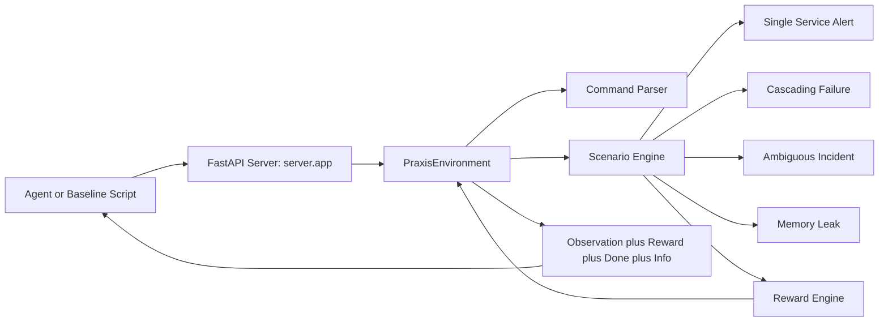

**One line pitch:** Praxis is an OpenEnv style incident bridge where an agent must investigate, plan, and remediate like an on call engineer, with rewards tied to the full trajectory, not a single lucky answer.

## Judge links and demo plots

### Links (judges start here)

- Live Space: [https://gp5901-praxis.hf.space](https://gp5901-praxis.hf.space)
- Space project page: [https://huggingface.co/spaces/gp5901/praxis](https://huggingface.co/spaces/gp5901/praxis)
- Space writeup: [Blog.MD on the Space repo](https://huggingface.co/spaces/gp5901/praxis/blob/main/Blog.MD) (mirrored in GitHub as [Blog.MD](https://github.com/GunaPalanivel/Praxis/blob/main/Blog.MD))
- Colab: [open `praxis_grpo_colab.ipynb` in Colab](https://colab.research.google.com/github/GunaPalanivel/Praxis/blob/main/praxis_grpo_colab.ipynb) (canonical: `https://colab.research.google.com/github/GunaPalanivel/Praxis/blob/main/praxis_grpo_colab.ipynb`)
- Source: [https://github.com/GunaPalanivel/Praxis](https://github.com/GunaPalanivel/Praxis)
- YouTube (demo screencast; replace with your public link): [https://www.youtube.com/watch?v=REPLACE_WITH_PUBLIC_ID](https://www.youtube.com/watch?v=REPLACE_WITH_PUBLIC_ID)
- Trackio dashboard (production GRPO run): _<TBD: filled in after the HF Jobs run completes; see `trackio_url` in [`checkpoints/praxis-grpo/run_manifest.json`](checkpoints/praxis-grpo/run_manifest.json) and [docs/training_links.md](docs/training_links.md)>_. WandB is not used on this branch (`_init_wandb` is a no-op stub); set `TRACKIO_SPACE_ID=gp5901/trackio` and submit via [`scripts/submit_hf_grpo_job.py`](scripts/submit_hf_grpo_job.py).
- **Colab run exports (repo root):** [`colabresults/`](colabresults/README.md) — latest curves, `jsonl`/`csv` logs, rollout traces, and [`colabresults/eval_checkpoints.json`](colabresults/eval_checkpoints.json) in one place for quick review.

**TRL training (`train_praxis_grpo.py`, non-smoke):** the GRPO `reward_func` runs a **trajectory** per completion: one `reset` per row, then one `/step` per non-empty line of the model output (in order, capped by `--max-turns`), or a single step when the model emits one line. The scalar label prefers the server’s ADR-20 `final_score` on `/state` when the episode is terminal, otherwise the mean of per-step rewards. Use an external Praxis process in production; local auto-start writes uvicorn stderr to a temp file (see [docs/deployment.md](docs/deployment.md)).

### Plots (same files the notebook and scripts point at)

| Rollout compare (static) | Before/after motion (8s loop) |
| --- | --- |
|  |  |

Caption: baseline vs trained on one chart; GIF highlights the same comparison. Full log is in [docs/training_evolution.md](docs/training_evolution.md).


Caption: reward curve with a fixed random mean reference line, plus a matching loss series in [docs/figures/loss_curve.png](docs/figures/loss_curve.png).

# Praxis: Production Incident Response Training for AI Agents

Praxis is an OpenEnv-compatible environment that trains and evaluates agents on real-world SRE incident response.
Agents investigate logs and metrics, diagnose root causes, and execute remediations through a command-driven API.

> Built for [Meta PyTorch OpenEnv Hackathon x SST](https://www.scaler.com/school-of-technology/meta-pytorch-hackathon)

## Why This Matters

Incident response is a real production workflow, not a toy benchmark. On-call engineers repeatedly perform triage,
evidence gathering, diagnosis, and remediation under time pressure. Praxis models that workflow with deterministic tasks
and programmatic graders so agent progress can be measured reliably.

The evaluation design targets practical utility: four escalating tasks, reward shaping over the trajectory, and clear
success criteria. This gives useful signal for both training and model comparison while remaining reproducible for
judging and regression testing.

## Quick Start (5 Commands)

```bash
git clone https://github.com/GunaPalanivel/Praxis.git
cd Praxis
pip install -e ".[dev]"
python -m uvicorn server.app:app --host 0.0.0.0 --port 7860
curl http://localhost:7860/health
```

Optional smoke checks:

```bash
curl http://localhost:7860/tasks
curl -X POST http://localhost:7860/reset
curl -X POST http://localhost:7860/reset -H "Content-Type: application/json" -d '{}'
curl -X POST http://localhost:7860/reset -H "Content-Type: application/json" -d '{"task_name":"single-service-alert"}'
curl -X POST http://localhost:7860/step -H "Content-Type: application/json" -d '{"command":"query_logs service=auth timerange=5m"}'
```

## Environment Overview

### Action Space

The agent sends one text command per step.

| Command Template                                | Purpose                                                     |
| ----------------------------------------------- | ----------------------------------------------------------- |
| `query_logs service=<name> timerange=<N>m`      | Inspect service logs over a time window                     |
| `check_metrics service=<name> metric=<type>`    | Read service or infrastructure metrics                      |
| `check_deps service=<name>`                     | Inspect dependency graph for a service                      |
| `check_config service=<name>`                   | Inspect recent config and deployment changes                |
| `check_runbook service=<name>`                  | Access institutional SRE runbooks for triage guidance       |
| `diagnose root_cause=<cause>`                   | Declare the suspected root cause                            |
| `restart_service service=<name>`                | Restart a service as remediation                            |
| `rollback_deploy service=<name>`                | Roll back a recent deploy                                   |
| `scale_resource service=<name> resource=<type>` | Increase/adjust capacity (task dependent)                   |
| `kill_query service=<name> query_id=<id>`       | Stop a runaway query                                        |
| `escalate reason=<text>`                        | Escalate with evidence when direct remediation is not ideal |

Valid metric examples include `error_rate`, `latency_p95`, `connections`, `memory`, `cpu`, and `resolution_failures`.

### Observation Space

Each `reset` and `step` returns a `PraxisObservation` payload with these fields:

| Field                  | Type               | Meaning                                                        |
| ---------------------- | ------------------ | -------------------------------------------------------------- |
| `alert_summary`        | string             | Current incident summary                                       |
| `system_status`        | map<string,string> | Service health map (`healthy`, `degraded`, `critical`, `down`) |
| `investigation_result` | string             | Result of the latest action                                    |
| `available_commands`   | list<string>       | Command templates the agent can issue                          |
| `time_elapsed_minutes` | float              | Incident time progression (2.5 minutes per step)               |
| `severity`             | string             | Incident severity (`P0`, `P1`, `P2`, `P3`)                     |
| `services_affected`    | list<string>       | Services currently not healthy                                 |
| `step_number`          | int                | Current step index                                             |

Text fields are ASCII-normalized for stable local console output.

### Episode State

`GET /state` returns compact state metadata:

- `episode_id`
- `step_count`
- `task_name`
- `incident_resolved`
- `root_cause_identified`
- `cumulative_reward`

Praxis is deterministic: the same action sequence yields the same outputs and rewards.

## Tasks

| Task                   | Difficulty | Severity | Max Steps | Scenario Summary                                                          | Optimal Path Score |
| ---------------------- | ---------- | -------- | --------- | ------------------------------------------------------------------------- | ------------------ |
| `single-service-alert` | Easy       | P2       | 15        | Auth fails after a bad deployment config typo in DB host settings         | 0.63               |
| `ambiguous-incident`   | Medium     | P2       | 25        | Intermittent multi-service failures caused by DNS misconfiguration        | 0.71               |
| `cascading-failure`    | Hard       | P1       | 20        | Runaway analytics query exhausts DB connection pool and cascades failures | 0.458              |
| `memory-leak`          | Hard       | P2       | 25        | Worker OOM crashes from oversized batch processing configuration          | 0.475              |

`POST /reset` also accepts difficulty aliases: `easy` -> `single-service-alert`, `medium` -> `ambiguous-incident`, `hard` -> `cascading-failure`.

Difficulty progression is intentional: isolated service incident (easy) -> ambiguous cross-service investigation with infra evidence gating (medium) -> high-pressure remediation incidents (hard).

## Reward Function

Rewards are per-step and clamped to `[0.01, 0.99]`.

- **Investigation actions**: small positive signal when evidence is relevant.
- **Correct diagnosis**: larger positive signal.
- **Correct remediation or evidence-backed escalation**: highest positive signal.
- **Wrong diagnosis, wrong remediation, or premature escalation**: near-zero credit after penalties.
- **Duplicate actions**: penalized (50% reduction).
- **Step cost**: medium applies a 0.003 per-step cost; hard tasks use stronger pressure (0.006 for cascading-failure, 0.005 for memory-leak).
- **Runbook usage**: agents that consult institutional runbooks (`check_runbook`) receive a small bonus.

Centralized scoring lives in `server/reward.py` and is shared across all scenarios.

## Architecture


```mermaid
flowchart LR
    A[Agent or Baseline Script] --> B[FastAPI Server: server.app]
    B --> C[PraxisEnvironment]
    C --> D[Command Parser]
    C --> E[Scenario Engine]
    E --> F[Single Service Alert]
    E --> G[Cascading Failure]
    E --> H[Ambiguous Incident]
    E --> K[Memory Leak]
    E --> I[Reward Engine]
    I --> C
    C --> J[Observation plus Reward plus Done plus Info]
    J --> A
```

## Baseline Scores

### Inference snapshot (current code tree, 2026-04-26)

`python inference.py --model random --runs 1` per task (local `PRAXIS_URL` server, seed 2026). Stochastic: re-run to refresh; live HF Space scores can differ when using `--model router` with a hosted model.

| Task                 | Difficulty | Mean score (one run) |
| -------------------- | ---------- | --------------------: |
| single-service-alert | Easy       | 0.122 |
| ambiguous-incident | Medium     | 0.010 |
| cascading-failure    | Hard       | 0.441 |
| memory-leak          | Hard       | 0.010 |
| **Mean (4 tasks)**   | —          | 0.146 |

### Live Space reference (Qwen2.5-72B, earlier pull)

| Task                 | Difficulty | Steps | Score (2026-04-10) |
| -------------------- | ---------- | ----- | -----------------: |
| single-service-alert | Easy       | 5     | 0.092 |
| cascading-failure    | Hard       | 20    | 0.041 |
| ambiguous-incident   | Medium     | 25    | 0.020 |
| memory-leak          | Hard       | 5     | 0.095 |
| Mean task score      | -          | -     | 0.062 |

### GRPO smoke run vs baseline (explanation for merge review)

On the early April 26 smoke GRPO evidence (before updated `lr=1e-4` and longer runs), **only `single-service-alert` clearly improved**; three tasks regressed, which matches short CPU smoke training and aggressive settings. The **200+ episode GPU run** with `train_praxis_grpo.py --learning-rate 1e-4 --group-size 8` and the current reward (`efficiency_bonus_max=0.1` floor in policy) is the intended way to re-check all four — submit it via [`scripts/submit_hf_grpo_job.py`](scripts/submit_hf_grpo_job.py); see [`scripts/README.md`](scripts/README.md) and [`docs/training_links.md`](docs/training_links.md) for the one-command flow. See [`colabresults/eval_checkpoints.json`](colabresults/eval_checkpoints.json) for stored checkpoint means and [docs/training_evolution.md](docs/training_evolution.md) for the narrative.

### Production GRPO run (HF Jobs)

_Pending the HF Jobs run; this section is filled in by the same PR commit that lands `colabresults/grpo_full_run/`._

| Task                 | Baseline (smoke) | Trained (GPU run) | &Delta; |
| -------------------- | ---------------: | ----------------: | ------: |
| single-service-alert |               TBD |               TBD |     TBD |
| ambiguous-incident   |               TBD |               TBD |     TBD |
| cascading-failure    |               TBD |               TBD |     TBD |
| memory-leak          |               TBD |               TBD |     TBD |
| **Mean (4 tasks)**   |               TBD |               TBD |     TBD |

Verification artifacts after the run:

- Trackio dashboard: TBD (also recorded in `trackio_url` of `run_manifest.json`).
- Hub model + checkpoints: TBD (also recorded in `hub_model_id` of `run_manifest.json`).
- Per-task metrics CSV + manifest: `colabresults/grpo_full_run/{metrics.csv,run_manifest.json}`.

## Training Evidence Artifacts

Plots and judge-facing figures are under **[`docs/figures/`](docs/figures/)** (see [`docs/figures/README.md`](docs/figures/README.md) for a file index). **Latest Colab / training run exports** (curves, logs, traces) are in **[`colabresults/`](colabresults/README.md)** at the repo root.

- `praxis_grpo_colab.ipynb` (TRL Colab notebook over HTTP; plots default to `docs/figures/`; copy or save run bundles under `colabresults/` when you publish evidence)
- `docs/figures/reward_curve.png` (baseline vs trained comparison on same axes)
- `docs/figures/loss_curve.png` (training loss curve)
- `docs/rollout_baseline.txt` (real baseline rollout trace)
- `docs/rollout_trained.txt` (real trained-policy rollout trace)
- `docs/figures/rollout_compare.png` (before/after comparison on one chart)
- `docs/demo.gif` (8s loop, same story as the chart)
- [`colabresults/eval_checkpoints.json`](colabresults/eval_checkpoints.json) (baseline vs trained + config metadata; regenerate after GPU runs)
- `docs/training_evolution.md` (training journey and reward progression summary)
- `docs/training_links.md` (training artifact index and rerun command)

### Inference Output Contract

`inference.py` emits strict structured lines for judge parsing:

```text
[START] task=<task_name> env=<benchmark> model=<model_name>
[STEP] step=<n> action=<action_str> reward=<0.00> done=<true|false> error=<msg|null>
[END] success=<true|false> steps=<n> score=<0.000> rewards=<r1,r2,...,rn>
```

- Per-step rewards are clamped to `[0.01, 0.99]`.
- Task score is computed as mean(step rewards), clamped to `[0.001, 0.999]`.

## Development

Install and test:

```bash
pip install -e ".[dev]"
pytest tests/ -v --tb=short
```

Run contract checks:

```bash
openenv validate
```

Container workflow:

```bash
docker build -t praxis-env:latest .
docker run --rm -p 7860:7860 --name praxis-env praxis-env:latest
```

To add a new scenario, implement a deterministic scenario class under `praxis_env/scenarios/`, register it,
and add task-specific tests under `tests/`.

## API Reference

| Endpoint  | Method | Request                              | Response                                |
| --------- | ------ | ------------------------------------ | --------------------------------------- |
| `/health` | GET    | none                                 | status, version, available tasks        |
| `/tasks`  | GET    | none                                 | task list                               |
| `/reset`  | POST   | none, `{}`, or `{"task_name":"..."}` | initial observation                     |
| `/step`   | POST   | `{"command":"..."}`                  | `observation`, `reward`, `done`, `info` |
| `/state`  | GET    | none                                 | episode metadata                        |

`POST /reset` accepts an optional JSON body. If no body is sent (or `{}` is
sent), the default task is `single-service-alert`.

`observation` in `/step` and `/reset` includes:
`alert_summary`, `system_status`, `investigation_result`, `available_commands`,
`time_elapsed_minutes`, `severity`, `services_affected`, and `step_number`.

The `command` body for `/step` must follow the action templates listed in the
Action Space section.

Minimal request examples:

```bash
curl -X POST http://localhost:7860/reset
curl -X POST http://localhost:7860/reset -H "Content-Type: application/json" -d '{}'
curl -X POST http://localhost:7860/reset -H "Content-Type: application/json" -d '{"task_name":"single-service-alert"}'
curl -X POST http://localhost:7860/step -H "Content-Type: application/json" -d '{"command":"diagnose root_cause=bad_config"}'
```

## Deployment

Praxis ships with a root Dockerfile and runs on port 7860 for Hugging Face Docker Spaces.
Deployment checklist and commands are in [docs/deployment.md](docs/deployment.md).

## Repository Layout

- `praxis_env/` - package models, client, scenarios
- `server/` - FastAPI app, parser, environment orchestration, reward engine
- `tests/` - scenario, reward, API contract, and inference tests
- `docs/` - detailed technical documentation
- `idea/` - local planning and research notes
