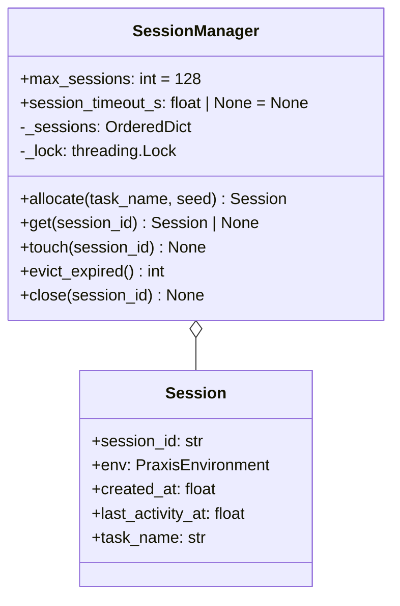

# Concurrency Model — Sessions, Locks, Eviction

> Removes the global `env = PraxisEnvironment()` singleton at
> [`server/app.py:46`](../../../server/app.py) so GRPO parallel rollouts and
> multiple judges can hit the same Space without state corruption.
>
> Mirrors OpenEnv's pattern in `OpenEnv/src/openenv/core/env_server/interfaces.py`
> (`SUPPORTS_CONCURRENT_SESSIONS`) and the factory style in
> `OpenEnv/src/openenv/cli/templates/openenv_env/server/app.py` (`create_app(..., max_concurrent_envs=N)`).

---

## 1. Why this is a P0 blocker

- TRL `GRPOTrainer` rolls out **N parallel completions per prompt** (`num_generations=8` is typical). Each rollout needs its own environment.
- The OpenEnv runtime validator may open multiple WebSocket / HTTP sessions and expects independent state per session.
- Without sessions, two parallel `/step` calls clobber `self._scenario._step_count` → non-deterministic rewards → judging disqualification (graders that always return same/wrong score).

---

## 2. Session manager



- `_sessions` is an `OrderedDict`; eviction policy is **LRU on access** (`move_to_end` on `get`/`touch`).
- A single `threading.Lock` guards mutations. Reads under the lock so we never iterate while another writer mutates.
- `max_sessions = 128` (tunable via `PRAXIS_MAX_SESSIONS` env var). At capacity the oldest session is `popitem(last=False)`-evicted before insertion.
- `session_timeout_s` defaults to `None` (no auto-expiry); GRPO rollouts are short-lived so passive eviction is enough.

---

## 3. Request routing

```mermaid
flowchart LR
    R[/POST /reset/] --> A[allocate_session]
    S[/POST /step/] --> H{X-Session-Id?}
    G[/GET /state/] --> H
    H -- present --> L[get(id)]
    H -- missing --> F[fallback: last session]
    L -- found --> Touch[touch(id) → run env.step]
    L -- not found --> Err400[400 No active session]
    F -- exists --> Touch
    F -- empty --> Err400
```

`/reset` is the only endpoint that **creates** a session. `/step` and `/state` only **look up**. The fallback path is a soft-deprecated bridge for judges that forget to forward the header; it logs a `WARN` and uses the most recently touched session.

---

## 4. FastAPI integration (shipped)

`server/app.py` now swaps the module-level singleton for `SessionManager`, and `server/session_manager.py` provides allocation, lookup, touch, and close with lock-guarded mutations.

```python
from threading import Lock
from collections import OrderedDict
from uuid import uuid4

class SessionManager:
    def __init__(self, max_sessions: int = 128) -> None:
        self._sessions: OrderedDict[str, "Session"] = OrderedDict()
        self._lock = Lock()
        self.max_sessions = max_sessions

    def allocate(self, task_name: str, seed: int | None) -> "Session":
        with self._lock:
            if len(self._sessions) >= self.max_sessions:
                self._sessions.popitem(last=False)
            sid = str(uuid4())
            env = PraxisEnvironment()
            env.reset(task_name=task_name, seed=seed)
            sess = Session(session_id=sid, env=env, task_name=task_name, ...)
            self._sessions[sid] = sess
            return sess

    def get(self, sid: str | None) -> "Session | None":
        with self._lock:
            if sid and sid in self._sessions:
                self._sessions.move_to_end(sid)
                return self._sessions[sid]
            if not sid and self._sessions:
                # bridge mode — last session
                return next(reversed(self._sessions.values()))
            return None

manager = SessionManager()
```

Then route handlers read `request.headers.get("x-session-id")` and call `manager.get(...)`.

---

## 5. OpenEnv parity flags

The `PraxisEnvironment` class declares the OpenEnv-recognised flag so the validator and UI accept concurrent sessions:

```python
class PraxisEnvironment:
    SUPPORTS_CONCURRENT_SESSIONS: bool = True
    REQUIRES_SINGLE_THREAD_EXECUTOR: bool = False
```

`openenv.yaml` mirrors this at the manifest level:

```yaml
supports_concurrent_sessions: true
themes:
  - long-horizon-planning
```

---

## 6. Test obligations (Issue #15)

A passing implementation must satisfy `tests/test_concurrent_sessions.py`:

- 8 parallel `/reset` calls return 8 distinct `session_id` values.
- Each session can run a different task simultaneously without `step_number` drift.
- LRU eviction triggers exactly when the 129th session is allocated; the oldest session id no longer resolves.
- `/step` with an unknown `X-Session-Id` returns 400 (no implicit session creation).
- All requests succeed within the existing `< 20 min` runtime budget on `vCPU=2, memory=8gb`.

---

## 7. Out of scope (deliberately)

- WebSocket transport — Praxis stays HTTP-only for the hackathon. The OpenEnv `WSReset/Step/State` shapes are documented for future parity but not implemented.
- Distributed sessions across replicas — single-process for HF Spaces. If we ever scale out, sessions move to Redis behind the same `SessionManager` interface.
