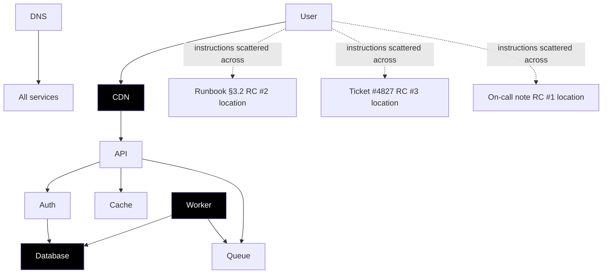

# Scenario Catalog — All 6 Tasks (post-Theme-#2)

> 4 shipping scenarios + 2 new ones. Every entry lists topology, root cause(s),
> red herrings, optimal path, target reward, and memory pressure.
>
> Authoritative implementation references live in
> [`praxis_env/scenarios/`](../../../praxis_env/scenarios) and
> [`server/reward.py`](../../../server/reward.py). See
> [`RewardPolicy.md`](./RewardPolicy.md) for full event tables and
> [`MemoryModel.md`](./MemoryModel.md) for cutoffs.

---

## 1. Catalog at a glance

| #   | Task                         | Difficulty    | `MAX_STEPS` | Memory cutoff | Target optimal | Status                 |
| --- | ---------------------------- | ------------- | ----------- | ------------- | -------------- | ---------------------- |
| 1   | `single-service-alert`       | easy          | 15          | n/a (≥15)     | ~0.63          | shipped                |
| 2   | `ambiguous-incident`         | medium        | 25          | 30 (n/a)      | ~0.71          | shipped                |
| 3   | `cascading-failure`          | hard          | 20          | 30 (n/a)      | ~0.46          | shipped                |
| 4   | `memory-leak`                | hard          | 25          | 20            | ~0.48          | shipped + Rootly artifacts (Issue #39) |
| 5   | `cascading-platform-failure` | mission       | 150         | 30            | ~0.55          | **MissionOps (Issues #25, #26, #27)** |
| 6   | `procedural-incident`        | easy/med/hard | 15/25/50    | 8/15/25       | scaled         | shipped (Issue #8)     |

All scenarios extend [`praxis_env/scenarios/base.BaseScenario`](../../../praxis_env/scenarios/base.py); rewards remain in `[0.01, 0.99]` per `clamp_reward()`.

---

## 2. Existing scenarios (recap)

Detailed designs live in [`idea/Architecture/scenario_design.md`](../../Architecture/scenario_design.md). Here we capture only the deltas needed for the Theme #2 story.

### `single-service-alert` — auth bad config

- Root cause: `bad_config` (typo `auhdb`).
- Memory: not exercised. Tools available but no cutoff pressure.

### `ambiguous-incident` — DNS misconfig

- Root cause: `dns_misconfiguration`. Evidence threshold = 4 investigations across ≥3 services + ≥1 infra.
- Memory: not exercised; agents tend to finish in <25 steps.

### `cascading-failure` — DB pool exhausted

- Root cause: `db_connection_pool_exhausted` (runaway analytics query).
- Memory: not exercised.

### `memory-leak` — worker OOM

- Root cause: gradual heap growth from caching unbounded session objects.
- **Memory IS exercised**: `MEMORY_CUTOFF_OVERRIDE = 20`; the agent must save the heap-growth observation by step 20 or lose the trail.

---

## 3. MissionOps Mega-Mission — `cascading-platform-failure` (Issues #25, #26)

> Pivoted from "120-step incident" to a **true mission** per ADR-16 / `FlawsToProduction/Verdict.md`. Long-horizon (80–150 turns), multi-phase, scattered instructions, hidden dependencies, real Rootly log artifacts (Issue #27, ADR-17).

### 3.1 Mission shape

```
Phase            Steps    Agent objectives                                            Pressure
──────────────── ──────── ─────────────────────────────────────────────────────────── ────────
Intake           1–8      Read on-call ticket + alert chain.                          P1
Exploration      9–35     Investigate ≥4 services; collect ≥3 artifact excerpts.      P1→P0 at 30
Planning         36–55    `create_plan` covering ≥3 root causes + milestone order.    P0
Execution        56–95    Diagnose RCs in plan order; checkpoint after each.          P0
Disturbance      ~96–105  Injected secondary incident (random of 3); plan invalid.    P0
Recovery         106–125  `revise_plan`; rollback if needed; re-execute.              P0
Completion       126–145  `submit_report` consistent with world state.                P0
Reflection       146–150  (Optional) `recall_memory` to summarise lessons.            —
```

`MAX_STEPS = 150`; `MEMORY_CUTOFF_OVERRIDE = 30`. Severity escalates from P1 to P0 at step 30 (the cutoff) — chosen so memory pressure and severity pressure align.

### 3.2 Topology + scattered instructions



The agent never gets a single "here are the 3 root causes" briefing. Each of the 3 root causes is hinted in **a different artifact kind** (runbook excerpt, prior-ticket excerpt, on-call note), drawn deterministically by `(mission_id, seed)` from the `ArtifactStore` (Issue #27). The mapping is:

| Artifact kind | Action that surfaces it | Drawn from |
| --- | --- | --- |
| Runbook excerpt | `check_runbook service=<x>` | Vendored `data/artifacts/runbooks/*.md` |
| Prior-ticket excerpt | `check_runbook service=<x> kind=ticket` (alias) | `data/artifacts/tickets/*.md` |
| On-call note | Returned alongside `query_logs` for the right service | `data/artifacts/notes/*.md` |
| Real production log line | `query_logs service=<x>` | Rootly `logs-dataset` sample (Apache-2.0, see §7) |

### 3.3 Hidden dependencies

| Dependency | Surfaced when | Effect |
| --- | --- | --- |
| RC #2 (cdn_tls) blocks RC #1 (db_pool) remediation | After `restart_service database` if cdn_tls not diagnosed | Restart fails with `tls_handshake` error in next observation; `RecoveryRubric` rewards the agent for noticing + re-planning. |
| RC #3 (worker_memory_leak) requires deploy rollback | After `kill_query` if rollback not done | Worker OOMs again ~6 steps later; agent must `rollback_deploy worker` before remediation. |
| Disturbance phase invalidates 1 of 3 plan milestones | Step ~100 | Agent must `revise_plan` and re-checkpoint. |

These dependencies are what `RecoveryRubric` measures.

### 3.4 Root causes + remediations

| RC tag | Location of hint | Diagnosis evidence required | Correct remediation |
| --- | --- | --- | --- |
| `db_pool_corrupted` | On-call note (random of 3 templates) | ≥3 DB log lines + 1 metric snapshot | `restart_service database` after `cdn_tls` resolved |
| `cdn_tls_expired` | Runbook §3.2 (random of 3 templates) | TLS cert metric + 1 CDN log line | `restart_service cdn` |
| `worker_memory_leak` | Prior ticket #482x (random of 3 templates) | Heap-growth metric + 2 worker log lines | `rollback_deploy worker` then `restart_service worker` |

### 3.5 Red herrings

`cache_eviction_spike`, `dns_ttl_warning`, `queue_backlog`, `api_latency_symptom`, `session_drift_rotation`, `lb_rebalance` — real signals, none are the cause. Sampled deterministically per mission seed so trajectories stay reproducible.

### 3.6 Reward milestones (rubric-aware — see RewardPolicy §8)

| Event | Value | Read by rubric |
| --- | --- | --- |
| `plan.created_pre_cutoff` | +0.05 | Planning |
| `plan.covers_all_root_causes` | +0.10 | Planning |
| `plan.revised_after_evidence` | +0.04 | Planning |
| `checkpoint.consistent` | +0.02 | Planning |
| `memory.save_finding.before_cutoff` | +0.05 | Memory |
| `memory.recall_memory.after_cutoff` | +0.08 | Memory |
| `recovery.detected_disturbance_within_3_steps` | +0.10 | Recovery |
| `recovery.rollback_before_restart` | +0.06 | Recovery |
| `recovery.replan_after_disturbance` | +0.05 | Recovery |
| `diagnosis.first_correct` | +0.12 | Terminal |
| `diagnosis.all_correct` | +0.15 | Terminal |
| `remediation.complete` | +0.20 | Terminal |
| `remediation.partial` | +0.05 | Terminal |
| `submit_report.consistent_with_world_state` | +0.20 | Terminal |
| `time_pressure_cost_per_step` | 0.002 | (subtracted) |
| `destructive_penalty` | −0.10 | Recovery |

Resolution rule: mission resolves only when (a) all 3 root causes diagnosed AND (b) all 3 corresponding remediations succeed AND (c) `submit_report` consistent with `_root_cause_identified` set + `_incident_resolved=True`. Anything less ⇒ `TerminalRubric.score = 0` ⇒ outcome × efficiency = 0 (ADR-20).

### 3.7 Optimal trajectory sketch (final score ≈ 0.55)

```
1–8     Read alert + on-call ticket. recall_memory (empty).
9–28    query_logs + check_runbook + check_metrics across api, db, cdn, worker.
        save_finding(key=db_pool_hint, value=...) etc.
29      [CONTEXT LIMIT REACHED] — full log gone, only saved findings remain.
30–55   create_plan covering 3 RCs with milestone order.
        revise_plan once after a new artifact contradicts initial guess.
56–80   Diagnose 3 RCs in dependency order; checkpoint after each.
81–95   Remediate cdn_tls → db_pool → rollback_deploy worker → restart worker.
~100    Disturbance: queue backlog spikes; invalidates milestone #4.
101–110 revise_plan + rollback if needed.
111–135 Re-execute remediations.
136–145 submit_report; mission resolves.
```

---

## 4. Scenario 6 — `procedural-incident` (seeded generator, shipped in Issue #8)

Infinite unique incidents from a deterministic seed. Turns Praxis from "4 tasks" into "∞ tasks" — the production training asset.

### 4.1 Difficulty config

| Difficulty | `n_services` | `n_red_herrings` | `MAX_STEPS` | Memory cutoff | Target optimal |
| ---------- | ------------ | ---------------- | ----------- | ------------- | -------------- |
| `easy`     | 1            | 0                | 15          | 8             | ~0.55          |
| `medium`   | 3            | 2                | 25          | 15            | ~0.45          |
| `hard`     | 5            | 4                | 50          | 25            | ~0.35          |

Default difficulty: `medium`.

### 4.2 Pools

```python
ROOT_CAUSE_POOL = [
    "db_connection", "auth_token", "dns_config", "memory_leak",
    "network_partition", "cpu_exhaustion", "disk_full", "cert_expiry",
]
RED_HERRING_POOL = [
    "cache_miss_spike", "queue_backlog", "scheduled_maintenance",
    "log_rotation", "metric_collector_lag", "cdn_rebalance",
]
SERVICE_POOL = [
    "api", "auth", "database", "cache", "worker",
    "queue", "cdn", "dns", "search", "frontend",
]
```

### 4.3 Determinism contract

```python
class ProceduralIncidentScenario(BaseScenario):
    NAME = "procedural-incident"

    def __init__(self, seed: int | None = None, difficulty: str = "medium"):
        super().__init__()
        self._rng = random.Random(seed)
        self._difficulty = difficulty
```

- Same `(seed, difficulty)` → byte-identical scenario data and grader output.
- `seed=None` is rejected at the `/reset` boundary (we always pick a seed and return it in metadata) so trajectories remain reproducible.

### 4.4 Reward policy auto-calibration

Reward map is built at scenario init by combining a per-difficulty multiplier with the canonical event table. Resolution requires diagnosing the chosen root cause and applying its mapped remediation. Memory bonuses are appended last so they work uniformly.

---

## 5. Registration

`praxis_env/scenarios/__init__.py` (Issue #9) becomes:

```python
SCENARIOS = {
    "single-service-alert":       SingleServiceAlertScenario,
    "ambiguous-incident":         AmbiguousIncidentScenario,
    "cascading-failure":          CascadingFailureScenario,
    "memory-leak":                MemoryLeakScenario,
    "cascading-platform-failure": MegaIncidentScenario,        # NEW
    "procedural-incident":        ProceduralIncidentScenario,  # NEW
}
```

`openenv.yaml` lists all 6 with their `max_steps` and `difficulty`, plus `supports_concurrent_sessions: true` and `themes: [long-horizon-planning]`. See [`APIContract.md`](./APIContract.md) §3.

---

## 6. Test coverage map

| Scenario                   | Test file                                  | New / existing                                  |
| -------------------------- | ------------------------------------------ | ----------------------------------------------- |
| single-service-alert       | `tests/test_task1_single_service_alert.py` | existing                                        |
| cascading-failure          | `tests/test_task2_cascading_failure.py`    | existing                                        |
| ambiguous-incident         | `tests/test_task3_ambiguous_incident.py`   | existing                                        |
| memory-leak                | `tests/test_task4_memory_leak.py`          | existing + Rootly excerpt smoke test (#27)      |
| cascading-platform-failure | `tests/test_task5_mission.py`              | NEW (Issues #25, #26) — phase machine, scattered instructions, hidden deps, disturbance, recovery |
| procedural-incident        | `tests/test_task6_procedural.py`           | shipped                                         |

Determinism tests run each scenario 3× per (seed, difficulty) and assert byte-identical reward vectors and mission artifact draws.

---

## 7. Rootly artifact provenance + license (Issue #27, ADR-17) — _shipped (Issue #38)_

> **Implementation status**: shipped in [`praxis_env/artifacts.py`](../../../praxis_env/artifacts.py),
> [`data/artifacts/`](../../../data/artifacts), and [`LICENSE-3rd-party`](../../../LICENSE-3rd-party).
> Vendoring deviated from the original Rootly source — see 7.1 below.

### 7.1 Source — _shipped (deviation noted)_

- **Originally planned**: Rootly AI Labs `logs-dataset` (Apache-2.0).
- **Status at vendoring time (2026-04-25)**: the dataset was not publicly
  available on Hugging Face (`Rootly-AI-Labs/logs-dataset` returned 404
  with and without auth). Loghub (the canonical real-world log corpus)
  ships under a research-only license incompatible with this repo.
- **What was shipped instead**: internally-authored Praxis fixtures
  modelled on real production formats (Apache common log / JSON
  structured logs / SRE runbook prose / Jira-style tickets / on-call
  note prose) under `data/artifacts/`. See
  [`data/artifacts/NOTICE.md`](../../../data/artifacts/NOTICE.md) for the
  full disclosure and follow-up plan.
- **Vendored sample size**: ≤ 200 KB (verified by
  `tests/test_artifacts.py::test_total_size_under_200kb`).
- **Provenance prefix**: `praxis:fixtures` (not `rootly:logs-dataset`)
  until a properly-licensed real-world source is identified.

### 7.2 Layout

```
data/artifacts/
├── README.md                      # what's in here, how it's used
├── NOTICE.md                      # Apache-2.0 attribution to Rootly AI Labs (S33)
├── logs/
│   ├── api_500s.jsonl             # real production access/error logs
│   ├── database_pool.jsonl
│   ├── cdn_tls.jsonl
│   ├── worker_oom.jsonl
│   └── ...
├── runbooks/
│   ├── db_pool_drain.md
│   ├── cdn_cert_rotation.md
│   └── ...
├── tickets/
│   ├── ticket_4827_worker_memory.md
│   └── ...
└── notes/
    ├── oncall_db_migration.md
    └── ...
```

### 7.3 `ArtifactStore` API (Issue #27)

```python
# praxis_env/artifacts.py
from dataclasses import dataclass
from pathlib import Path
import random

@dataclass(frozen=True)
class Artifact:
    kind: str           # "log" | "runbook" | "ticket" | "note"
    service: str        # "database" | "cdn" | "worker" | ...
    body: str           # excerpt content
    source: str         # e.g. "rootly:logs-dataset/api_500s#L42-L60"

class ArtifactStore:
    def __init__(self, root: Path, *, seed: int) -> None:
        self._rng = random.Random(seed)
        self._root = root
        self._index: dict[tuple[str, str], list[Artifact]] = {}
        self._load()

    def _load(self) -> None: ...
    def draw(self, kind: str, service: str, n: int = 1) -> list[Artifact]: ...
    def attribution(self) -> str: ...   # for /metadata
```

Determinism: `(seed, kind, service, n)` always returns the same artifacts in the same order. Tested in `tests/test_artifacts.py`.

### 7.4 Where artifacts surface

| Action | Artifact kinds returned | Scenario use |
| --- | --- | --- |
| `query_logs service=<x>` | `log` (1 excerpt) appended to investigation_result | All scenarios that use `ArtifactStore` |
| `check_runbook service=<x>` | `runbook` (1 excerpt) | MissionOps Exploration phase |
| `check_runbook service=<x> kind=ticket` | `ticket` (1 excerpt) | MissionOps Exploration phase |
| Initial `/reset` observation | `note` (on-call note) inlined into `alert_summary` | MissionOps Intake phase |

### 7.5 Compliance checklist (PR #38) — _shipped_

- [x] `data/artifacts/NOTICE.md` documents provenance + the
      Rootly-source-unavailable disclosure + follow-up plan.
- [x] `data/artifacts/README.md` documents the vendored subset, layout
      conventions, and exclusion rules (no PII, no secrets).
- [x] `LICENSE-3rd-party` shipped at the repo root, mirroring the
      NOTICE.
- [x] `praxis_env/artifacts.py::ArtifactStore.attribution()` returns
      the same string surfaced from `/metadata`.
- [x] `openenv.yaml` adds a `data_sources` block describing the
      vendored fixtures.
